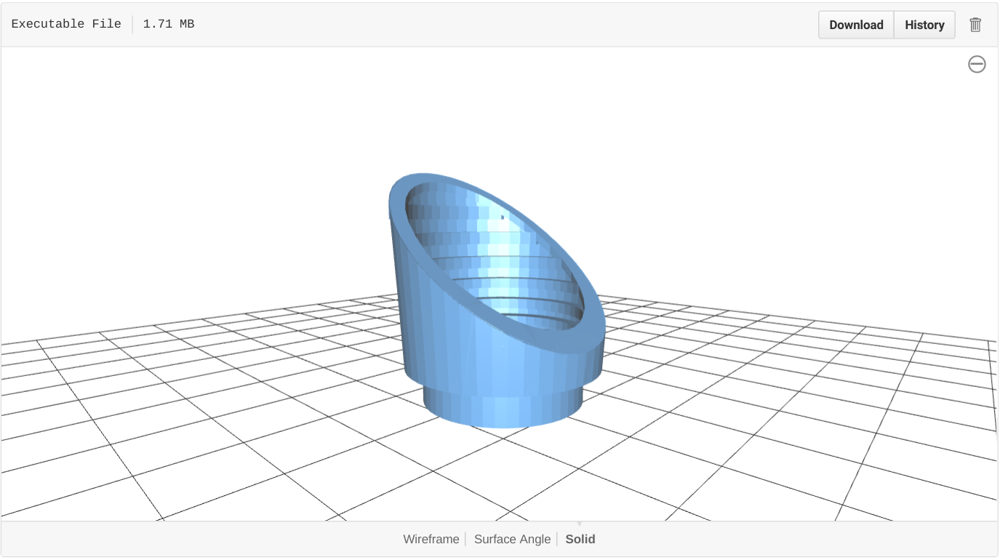

# Print your own Kepler Spacecraft 3D Puzzle!

Ever wanted to build your own exoplanet-hunting spacecraft? Now you can!

With the help of the [NASA Ames SpaceShop Rapid Prototyping Facility](https://www.nasa.gov/centers/ames/spaceshop/home), the Kepler mission has created a 3D puzzle which you can use to print your own mini planet hunter.  The puzzle was created for educational purposes, and as such the model files were scaled and simplified for durability where appropriate. 

* [Preview](#preview)
* [Model files](#model-files)
  * [Photometer](#photometer)
  * [Base](#base)
  * [Solar array](#solar-array)
  * [Sun shade](#sun-shade)
  * [Stand](#stand)
  * [Full spacecraft](#full-spacecraft)
* [Printing tips](#printing-tips)
* [Credits](#credits)
* [Caution](#caution)

If you decide to print this model, or if you end up using it for educational purposes, we would love to hear about your experiences. Please consider sharing a photograph of your experiment by opening a [pull request](pulls) or contact us at keplergo@mail.arc.nasa.gov.

## Preview

The images below show the 3D model as printed at the NASA Ames SpaceShop.

## Model files

Kepler is a space telescope launched by NASA in 2009 to determine the frequency of Earth-size planets in or near the habitable zone of other stars in our Galaxy.  It does this by searching for periodic dips in the brightness of stars, indicative of exoplanets transiting across their host stars, using a space telescope that is about 2.7 meters in diameter and 4.7 meters high. The telescope's main mirror is 0.95 meters in diameter.

### Photometer
The *photometer* hosts the telescope optics and the 84-CCD camera. The model file is called  [model-files/photometer.stl](model-files/photometer.stl).

### Base
The *base* contains the electronics to control the spacecraft. The exterior has the antennae and reaction wheels attached to the side. The model file is called [model-files/base.stl](model-files/base.stl).

### Solar array
The *solar array* shields the photometer from sunlight and generates electricity for the spacecraft to operate.
The model file is called[model-files/solar-array.stl](model-files/solar-array.stl).

### Sun shade
The *sun-shade* keeps sunlight from entering into the telescope.
The model file is called  [model-files/sun-shade.stl](model-files/sun-shade.stl).

### Stand
The *stand* allows the 3D-printed model to be displayed on a flat surface.  It is *not* an actual part of the spacecraft.
The model file is called  [model-files/base.stl](model-files/base.stl).

### Full spacecraft
In addition to the components, we also provide the full spacecraft as a single model file. **Note however that we have not verified the ability of 3D printers to print the entire spacecraft in one go, and expect that such attempts will require modifications (or glue).** If you decide to have a go at printing the spacecraft in one go, we would love to hear about your experiences. The model is called [model-files/full-spacecraft/kepler-spacecraft.stl](model-files/full-spacecraft/kepler-spacecraft.stl).

## Printing tips
We achieved the best results using the following settings:
* Solid print density
* Soluble support structure
* Existing file orientation (printer varying)

We encourage you to open a [pull request](pulls) to add additional tips!

## Credits
The 3D puzzle model files in this repository were derived from the [http://kepler.nasa.gov/multimedia/3dmodels/](original 3D Model Files made available on the NASA Kepler website). For the purpose of making them suitable for 3D printing, the original model files were scaled and simplified for durability. Credits:

NASA Ames SpaceShop Rapid Prototyping Facility
* Randall Ticknor
* Alex Mazhari

Kepler team:
* Charlie Sobeck
* Wendy Stenzel

The following software was used to create the printable files:
* Blender 2.77
* NetFabb Private 5.2

The contents of this repository are in the public domain.

## Caution

We recommend against placing the spacecraft on top of a cactus, as it may harm the scientific instruments!

