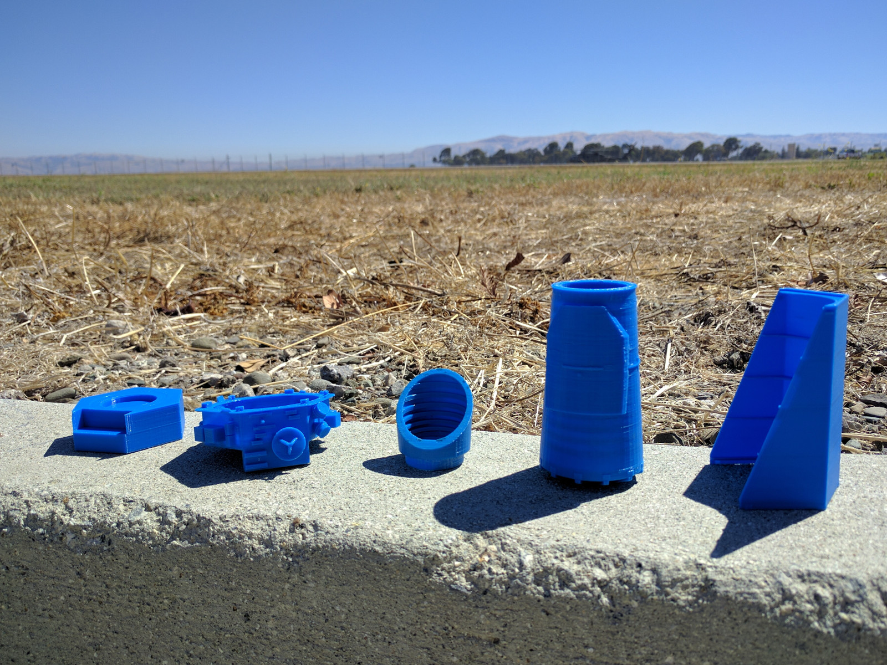

# Print your own Kepler Spacecraft 3D Puzzle!

Ever wanted to build your own exoplanet-hunting space telescope? Now you can!

With the help of the [NASA Ames SpaceShop Rapid Prototyping Facility](https://www.nasa.gov/centers/ames/spaceshop/home), the Kepler mission has created a five-piece 3D-printable puzzle of the planet-hunting spacecraft.  The puzzle was created for educational purposes, and as such the model files were scaled and simplified for durability where appropriate. 

* [Preview](#preview)
* [Model files](#model-files)
  * [Photometer](#photometer)
  * [Spacecraft](#spacecraft)
  * [Solar array](#solar-array)
  * [Sun shade](#sun-shade)
  * [Stand](#stand)
  * [Full spacecraft](#full-spacecraft)
* [Printing tips](#printing-tips)
* [Credits](#credits)
* [Caution](#caution)

If you decide to print this model, or if you end up using it for educational purposes, we would love to hear about your experiences. Please consider sharing a photograph of your experiment by opening a [pull request](pulls) or contact us at keplergo@mail.arc.nasa.gov.

A photo gallery showing the 3D-printed results obtained by Stephen Kane is available at http://physics.sfsu.edu/~skane/kepler/

## Preview

The images below show the 3D model as printed at the NASA Ames SpaceShop.  Note that the model consists of five individually-printed pieces which combine to form the full spacecraft as a fun puzzle.

## Model files

Kepler is a space telescope launched by NASA in 2009 to determine the frequency of Earth-size planets in or near the habitable zone of other stars in our Galaxy.  It does this by searching for periodic dips in the brightness of stars, indicative of exoplanets transiting across their host stars, using a space telescope that is about 2.7 meters in diameter and 4.7 meters high. The telescope's primary mirror is 1.5 meters in diameter.

### Photometer
The *photometer* hosts the telescope optics and the 84-CCD camera. The model file is called  [model-files/photometer.stl](model-files/photometer.stl).

### Spacecraft
The *spacecraft* contains the electronics required to control the telescope. Attached to the exterior you can see the antennae, reaction wheels, and thrusters. The model file is called [model-files/spacecraft.stl](model-files/spacecraft.stl).

### Solar array
The *solar array* shields the photometer from sunlight and generates electricity for the spacecraft to operate.
The model file is called [model-files/solar-array.stl](model-files/solar-array.stl).

### Sun shade
The *sun-shade* keeps sunlight from entering into the telescope.
The model file is called [model-files/sun-shield.stl](model-files/sun-shield.stl).

### Stand
The *stand* allows the 3D-printed model to be displayed on a flat surface.  It is *not* an actual part of the spacecraft.
The model file is called [model-files/stand.stl](model-files/stand.stl).

### Full spacecraft
In addition to the individual components above, we also provide the full spacecraft as a single model file (albeit excluding the stand).  This file was modified slightly to alter the tolerances at the joints. A dab of regular instant glue may be placed at any major connection point to permanently fuse the plastic. The stand file can be printed separately to complement this model if desired. 
The model file is called [model-files/full-spacecraft/kepler-spacecraft.stl](model-files/full-spacecraft/kepler-spacecraft.stl).

## Printing tips
We achieved the best results using the following settings:
* Solid print density
* Soluble support structure
* Existing file orientation (printer varying)

We encourage you to open a [pull request](pulls) to add additional tips!

## Credits
The 3D puzzle model files in this repository were derived from the original files found at  [http://kepler.nasa.gov/multimedia/3dmodels/](http://kepler.nasa.gov/multimedia/3dmodels/). For the purpose of making them suitable for 3D printing, the original model files were scaled and simplified for durability.

Credits for this effort belong to:
* NASA Ames SpaceShop Rapid Prototyping Facility
 * Randall Ticknor
 * Alex Mazhari
* Kepler team:
 * Charlie Sobeck
 * Wendy Stenzel
 * Geert Barentsen

The following software was used to create the printable files:
* Blender 2.77
* NetFabb Private 5.2

The contents of this repository are in the public domain.

## Caution

We recommend against placing the spacecraft on top of a cactus, as it may harm the scientific instruments!

